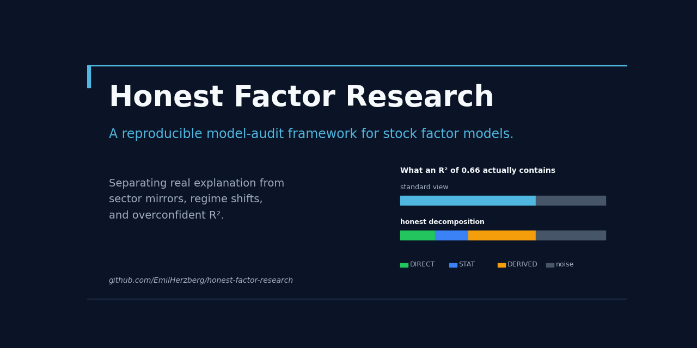
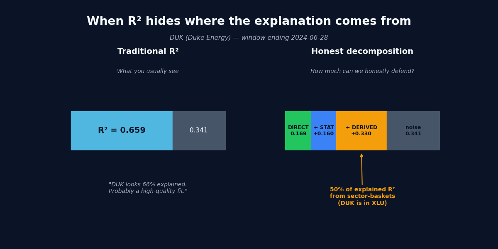
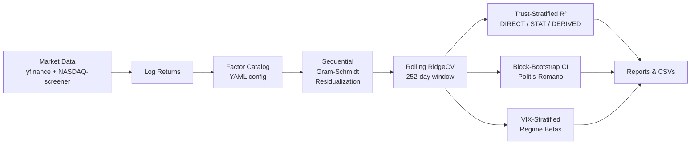

<p align="center">
  
</p>

# Honest Factor Research

> **A reproducible model-audit framework for stock factor models.**
> Separates real explanation from inflated explanation — sector mirrors,
> regime shifts, proxy contamination, and overconfident statistics.

[](https://www.python.org/downloads/)
[](LICENSE)
[](#)
[](#reproducibility)
[](https://github.com/EmilHerzberg/honest-factor-research/actions)

> **This project audits stock factor models.**
> **It does not try to predict the market.**
> **It asks whether a model's explanation can actually be trusted.**

> ⚠️ Not investment advice. Research and educational purposes only —
> no trading recommendations, portfolio advice, or financial forecasts.
> See [Limitations](#limitations).

---

## Start here

Different readers will care about different things:

- **New to factor models?** Read the [Plain-English Guide](docs/00-plain-english-guide.md).
- **Want to run it?** Jump to [Quickstart](#quickstart).
- **Reviewing the methodology?** Read [METHODOLOGY.md](METHODOLOGY.md).
- **Looking for evidence?** See the [Research Reports](reports/).
- **Evaluating this as a portfolio project?** See [For recruiters and AI teams](#for-recruiters-and-ai-teams).
- **Looking up a term?** See [Glossary](docs/glossary.md).

---

## What this project does

Most stock factor models report impressive R² values — sometimes 0.7, 0.8,
even 0.9.

But that single number hides four problems that determine whether the
model is actually useful:

1. **Sector mirrors** — does the factor ETF you're using *already contain*
   the stock you're explaining? (e.g. ExxonMobil regressed against XLE,
   where ExxonMobil is 22% of XLE)
2. **Proxy contamination** — does your factor proxy measure what its name
   claims? (e.g. XLV "Healthcare" is 10% UnitedHealth, a health insurer —
   not a pharma company)
3. **Regime shifts** — does the same beta apply when markets are calm
   AND when they're in crisis? (Static beta is an average across regimes;
   in any specific regime it can be wrong.)
4. **Overconfident statistics** — Ridge regression implicitly assumes
   Gauß errors, but daily returns have fat tails. The point R² is
   misleadingly smooth.

**A normal model asks:** "How much of this stock can we explain?"
**This project asks:** "How much of that explanation can we honestly defend?"

---

## Why it matters

| Audience | What this gives you |
|---|---|
| **For investors / analysts** | A way to see when a model *looks* good but actually contains very little real explanatory power. |
| **For data scientists / ML engineers** | A testbed for model evaluation, leakage detection, robustness checks, and uncertainty quantification on noisy real-world data. |
| **For AI startup / product teams** | A working example of how to operationalize model trust, uncertainty estimates, and critical evaluation in a domain where overconfidence is easy. |

---

## Why this matters beyond finance

Financial factor models are a useful **testbed** for a broader problem
in applied ML evaluation. The same failure patterns appear far outside
finance:

| Problem here (finance) | Same problem elsewhere (ML) |
|---|---|
| Sector ETF contains the stock being explained | Training feature leaks the target |
| Beta flips between high-VIX and low-VIX regimes | Model fails under distribution shift |
| Proxy ETF doesn't measure what its name says | Benchmark dataset doesn't match deployment population |
| Single R² hides fat-tail uncertainty | Single accuracy score hides per-slice failure modes |
| Static averages mask regime structure | Pooled metrics hide subgroup performance gaps |

The shared lesson: **a model that reports confident outputs while the
evaluation setup hides what's actually being measured is more dangerous
than a model that's openly uncertain.**

This repo demonstrates how to make model evaluation more skeptical,
more structured, and more transparent — using a domain (US equity
factor models) where the failure modes are well-known and the data is
freely available.

---

## In plain English

Imagine a model that explains Duke Energy (DUK) using the utilities sector
ETF (XLU). At first glance the fit looks great — R² of ~0.66.

But DUK is *itself* a significant constituent of XLU. So the model is partly
explaining DUK with a basket that already contains DUK. It's not exactly
wrong, but it's much less informative than the high R² suggests. A more
honest read: "this model explains DUK with direct macro factors at ~17% R²,
plus ~16% from style factors — and the remaining ~33% (about half the
apparent fit) is mostly DUK-explaining-DUK."

This project builds tools to detect that pattern automatically across
many stocks and factors, and to report what's left when you strip the
mirror out. (Energy names like ExxonMobil used to show the same self-mirror
against XLE — XOM is 22% of XLE — until we replaced XLE with a direct
Brent-oil factor. That's exactly the kind of fix this audit surfaces.)

---

## Core concepts

Brief plain-language explanations. Full definitions in [`docs/glossary.md`](docs/glossary.md).

- **Factor model** — explains a stock's return as the sum of weighted
  exposures to common drivers (market, interest rates, oil price, value,
  growth, etc.) plus a residual.
- **R²** — the fraction of a stock's return variance that the factors
  jointly explain. Higher = better fit (allegedly).
- **Honest R² (trust-stratified)** — R² split into how much comes from
  trustworthy direct factors vs how much comes from sector baskets
  (which may be self-mirroring).
- **Sector mirror** — when the factor ETF used to "explain" a stock
  already contains that stock as a significant constituent.
- **Regime shift** — the model's beta changes meaningfully between
  high-volatility and low-volatility market periods.
- **Beta flip** — extreme case of regime shift: the beta literally
  reverses sign between regimes.
- **Block-bootstrap confidence interval** — a non-parametric way to
  report "this R² is between 0.55 and 0.70 with 90% confidence" instead
  of a single point that hides fat-tail uncertainty.

---

## Data scope

Four universe sizes appear throughout this repo. They are **nested subsets of
the same 2005–2025 run**, not separate datasets — the differences are purely
how much price history each analysis requires:

| Count | What it is | Used by |
|---|---|---|
| **~2,944** | The **broad universe** — top-market-cap US stocks pulled for 2005–2025 (the raw constituent list, before any history filter). | What the pipeline streams over. |
| **2,758** | Stocks with **≥252 trading days (~1 year)** of returns — enough for a single trust-stratified R² window. | Analysis 6 (trust-stratified R²) — the headline `r²_direct ≈ 0.25` collapse. |
| **2,385** | Stocks with **~3.5 years** of history — enough for the multi-snapshot per-sector replay. | Analysis 8 (broad-universe per-sector factor relevance). |
| **60** | A **curated large-cap sample** — the deliberately flattering benchmark. | Shown alongside the broad universe to expose selection bias (`r²_direct ≈ 0.43` vs 0.25). |

So "2,758 with sufficient history" and "2,385 stocks" are the *same run* measured
at two different minimum-history thresholds; the curated **60** is the optimistic
comparison the broad universe corrects.

---

## Key findings

All numbers below come from actually running the pipeline across the broad
universe of **~2,944** top-market-cap US stocks over **2005–2025** (see
[Data scope](#data-scope) above for the 2,758 / 2,385 subsets), with the
curated 60-stock large-cap sample shown alongside to expose selection bias.
See [`reports/`](reports/) for the raw outputs.

| Finding | Plain-English meaning | Why it matters |
|---|---|---|
| **The collapse:** on a curated 60-stock large-cap sample, direct factors explain **r²_direct ≈ 0.43**; across the full **~2,758-stock** universe that drops to **0.25** (total R² 0.60 → 0.35) | A clean, large-cap sample makes a factor model look far more explanatory than it is on the real, broad market | Selection bias inflates apparent model quality — the curated benchmark is the optimistic lie |
| **1,189 of 2,758 assets (43%)** fall from MED to LOW tier under trust-stratified evaluation once self-mirroring sector baskets are stripped | Most mid/small-caps are genuinely idiosyncratic — the factors don't really explain them | A single R² is a misleading quality metric for production systems |
| **14.9% of asset-factor pairs** have regime-dependent beta with `\|t_diff\| ≥ 2.5` between high-VIX and low-VIX — down from **18.3%** on the curated sample | Static beta is wrong in at least one regime for ~1 in 7 pairs — and even that instability rate was over-stated by the curated sample | Models that don't account for regimes will fail exactly when markets get interesting |
| **Lithium beat Gold** as a broadly explanatory factor (mean Δr²=+0.010 vs Gold's +0.004 across 2,385 stocks) | Theory said Gold was essential. Data disagreed. | Empirical validation can overturn intuitive priors — don't trust theory without checking |
| **Brent-spot replaced XLE** for oil exposure → energy stocks become *directly* explained instead of sector-mirrored (over 20 years XOM ends up ~49% direct-explained, not a self-mirror) | The factor ETF (XLE) was measuring stock reactions to oil, not oil itself | Choosing the right proxy matters more than people realize |
| **Block-bootstrap CIs** widen to 0.2+ for windows that contain crisis days | Single-number R² hides huge uncertainty when the data is fat-tailed | If your CI is wide, the point estimate alone is misleading |
| **`growth × value` correlation** was fixed from -0.925 to +0.000 after re-ordering residualization | The original tier setup was double-counting style information | Residualization order is a real engineering decision, not a detail |

---

## Visual example

The headline methodology in one picture. **DUK (Duke Energy)** on
2024-06-28 — the standard R² is 0.658 (looks like a high-quality fit),
but trust-stratified decomposition reveals that **about half of the
explained variance comes from sector baskets** (DUK is a constituent of XLU):

> **Note:** 2024-06-28 is a *single* 252-day-window snapshot — one point in time
> inside the 2005–2025 long-history run, chosen to illustrate the method on one
> asset. It is **not** a separate short backtest; the headline universe-wide
> numbers above span the full 20 years.



A simpler view for any single asset using
[`examples/01_quickstart.py`](examples/01_quickstart.py):


---

## Architecture



---

## Technical highlights

For reviewers who care about the engineering, not just the findings:

- **Standalone Python package** — pure `pandas` + `scikit-learn` +
  `yfinance` + `pyyaml`. No proprietary databases, no paid feeds, no
  framework lock-in.
- **YAML-driven factor catalog** ([`config/factors.yaml`](honest_factor_research/config/factors.yaml))
  — 28 factors with declared tier, residualization order, trust class
  (DIRECT/STATISTICAL/DERIVED), and optional sector applicability.
- **Sequential Gram-Schmidt residualization** with full diagnostic
  validation (Analysis 1).
- **Stationary block-bootstrap** (Politis-Romano 1994) for time-series
  CI estimation — preserves autocorrelation that plain row-bootstrap
  breaks.
- **VIX-stratified regime betas** — separate Ridge fits on the
  low-VIX / high-VIX subsets of each window, with `min_obs` skip-logic.
- **Sector-conditional factor loading** — factors can declare
  `applicable_sectors: [...]` so each asset gets only relevant factors,
  not a kitchen-sink regression.
- **Memory-bounded broad-universe replay** — streams ~2,944 stocks × 241
  monthly snapshots × 15 variants through a process pool in symbol batches,
  so peak RAM stays flat regardless of universe size (~1.5 h on 6 cores for
  the full 2005–2025 run).
- **Reproducible reports** under [`reports/`](reports/) — markdown +
  CSVs from actual pipeline runs, not hand-edited.
- **Unit tests** for the core math (residualization correctness,
  block-bootstrap properties).
- **Pure data interfaces** — every pipeline function takes/returns
  pandas DataFrames, no hidden DB state.

---

## Quickstart

```bash
git clone https://github.com/EmilHerzberg/honest-factor-research
cd honest-factor-research
pip install -e ".[dev]"

# Run the headline trust-stratified analysis on the bundled sample data
python examples/01_quickstart.py
```

**Verified commands** (what works out-of-the-box vs. what needs extra data):

| Command | Works with bundled data? | Notes |
|---|---|---|
| `pytest tests/test_residualization.py tests/test_bootstrap.py` | ✅ yes (no data needed) | Pure-math tests, ~2 sec |
| `python examples/01_quickstart.py` | ✅ yes (bundled snapshot, 8.6 MB) | Tested, produces plot |
| `python examples/02_full_pipeline.py` | ✅ yes (bundled snapshot) | Full V3.5 pipeline on 5 tickers |
| `python examples/03_explain_single_stock.py --ticker DUK` | ✅ yes (bundled snapshot) | Single-ticker explainer CLI |
| `python -m honest_factor_research.analysis.trust_stratified` | ✅ yes (bundled snapshot) | Re-runs Analysis 6 |
| `python examples/reproduce_findings.py` | ⚠️ partial | Needs broad-universe OHLCV (~170 MB) for Analysis 8 — fetch via `python -m honest_factor_research.data.fetch` |

Output (verbatim from a fresh run):

```
Loading factor returns from: data/factor_etfs_2025-12-31.parquet
  -> 28 residualized factors over 5284 trading days

=== Trust-Stratified R² for AAPL on 2024-06-28 ===
r²_direct        = 0.256  (DIRECT factors only)
r²_+statistical  = 0.319  (+ STATISTICAL — marginal +0.063)
r²_total         = 0.351  (+ DERIVED — marginal +0.032)
derived_share    = 9.2%
idiosyncratic    = 64.9%

Plot saved: examples/01_quickstart_decomposition.png
```

Want to explain one specific ticker?

```bash
python examples/03_explain_single_stock.py --ticker XOM
```

Want the full pipeline with all V3.5 features (regime betas, block-bootstrap CIs)?

```bash
python examples/02_full_pipeline.py
```

Want to reproduce *all 10* analyses end-to-end?

```bash
# Note: Analysis 8 (broad universe) needs the full OHLCV dataset.
# Re-fetch via: python -m honest_factor_research.data.fetch (~5-15 min, ~170 MB).
python examples/reproduce_findings.py
```

---

## Example output (real run)

Trust-stratified decomposition from the bundled sample data:

```
Symbol: AAPL    Window-end: 2024-06-28
=====================================
Standard R² (point estimate)         : 0.351
Honest / Direct R²                   : 0.256  (DIRECT factors only)
Statistical-style component          : +0.063 (value + growth + momentum + quality)
Derived / Sector-mirror component    : +0.032 (XL* sector baskets etc.)
Unexplained / idiosyncratic          : 64.9%

Interpretation:
  - The model "looks like" it explains 35% of AAPL's variance.
  - Of that, 26% is from genuinely direct macro factors.
  - Another 6% is from academic style factors (medium trust).
  - Another 3% is from sector baskets — minimal mirror risk here.
  - The remaining 65% is genuinely idiosyncratic noise.
```

For a utility like DUK, the same analysis shows a much higher *derived*
share (~50%) — because XLU explains DUK via the self-mirror effect
described above. (Energy names like XOM used to look the same against XLE,
until the Brent-oil DIRECT factor reassigned that variance to a real macro
driver — on the 20-year data XOM is now ~49% direct-explained.)

---

## Project structure

```
honest-factor-research/
├── README.md                          # this file
├── METHODOLOGY.md                     # full methodology deep-dive
├── pyproject.toml                     # installable Python package
├── LICENSE                            # MIT
├── .github/workflows/tests.yml        # CI: lint + tests on every push
│
├── honest_factor_research/            # the Python package
│   ├── data/                          #   data fetching + I/O
│   ├── returns/                       #   factor return loading + residualization
│   ├── exposure/                      #   the rolling-Ridge pipeline
│   ├── analysis/                      #   10 research modules (CLI-runnable)
│   └── config/                        #   factors.yaml catalog
│
├── docs/                              # methodology + plain-English guide
│   ├── 00-plain-english-guide.md      #   for non-quants
│   ├── glossary.md                    #   terms used in the project
│   ├── 01-methodology.md              #   docs index
│   ├── 02-factor-taxonomy.md
│   ├── 03-trust-stratified-r2.md
│   ├── 04-sector-conditional.md
│   ├── 05-regime-switching.md
│   ├── 06-fat-tails-mitigation.md
│   ├── risks-and-improvements.md
│   └── future-investigations.md
│
├── examples/                          # runnable showcases
│   ├── 01_quickstart.py
│   ├── 02_full_pipeline.py
│   ├── 03_explain_single_stock.py     # per-ticker explainer CLI
│   └── reproduce_findings.py
│
├── reports/                           # research outputs as evidence
│   ├── README.md                      #   recommended reading order
│   ├── 2026-05-23-orthogonality-and-discovery/
│   ├── 2026-05-24-v3.4-validation/
│   ├── 2026-05-25-v3.5-regime-and-ci/
│   └── 2026-05-26-broad-universe-20y/   # 2005-2025 broad-universe headline run
│
├── data/                              # bundled sample snapshots
│   ├── factor_etfs_2025-12-31.parquet            # 28 ETFs + 61 demo stocks, 2005-2025
│   └── broad_universe_constituents_2026-05-24.csv
│
├── tests/                             # unit tests
└── assets/                            # visual specs + diagrams
    └── README.md
```

---

## For recruiters and AI teams

This project demonstrates:

- **Critical model evaluation** — designing diagnostics that show when a
  model is overconfident, not just when it's accurate
- **Reproducible research engineering** — every reported finding is
  reproducible from raw data via committed code; reports are real
  pipeline outputs, not hand-curated
- **Uncertainty quantification** — block-bootstrap CIs, regime
  stratification, trust-tier decomposition
- **Financial / quant ML literacy** — Ridge regression, factor models,
  Gram-Schmidt orthogonalization, autocorrelation-aware time-series
  resampling
- **Data engineering for noisy real-world feeds** — yfinance + NASDAQ
  screener pipelines with graceful failure handling, snapshot freezing
  for reproducibility, sector-conditional configuration
- **Product-oriented technical communication** — same content explained
  at three depths (README → plain-English guide → METHODOLOGY → code)
- **Python package organization** — clean module boundaries, YAML-driven
  configuration, CLI-runnable analysis modules, unit-tested core math
- **Pragmatic trade-off documentation** —
  [`docs/risks-and-improvements.md`](docs/risks-and-improvements.md) is a
  live risk register with explicit mitigations

If this looks like the shape of work you do, [I'd love to talk](mailto:emil.herzberg.eh@gmail.com).

---

## Why I built this

I built this project to explore a broader problem in applied AI and
financial modeling: **models can look precise while hiding leakage,
proxy contamination, regime shifts, and uncertainty.**

Financial factor models are a useful testbed because the data is noisy,
correlations are unstable, the literature has well-known pitfalls
(survivorship bias, look-ahead, regime shifts), and overconfident
explanations are extremely easy to produce.

The goal of this project is **not** to predict the market.
The goal is to **evaluate when a model's explanation can actually be
trusted** — and to build the tooling that makes that evaluation routine
rather than ad-hoc.

The same questions apply to many ML systems outside finance: when does
your validation R² overstate real-world performance? When does your
feature actually cause your prediction vs. when is it a leak? When do
your held-out metrics break under distribution shift? Factor models are
just an unusually data-rich playground for asking these questions.

---

## Reproducibility

Everything here is reproducible with free data sources:

- **yfinance** for OHLCV (used under their TOS for research / non-commercial use)
- **NASDAQ-screener public JSON API** for broad-universe constituents

No paid feeds, no proprietary calibration. To rebuild from scratch:

```bash
pip install -e ".[dev]"
python -m honest_factor_research.data.fetch --factors-only  # ~2 min
python examples/01_quickstart.py
```

For the full broad-universe replay (Analysis 8):

```bash
python -m honest_factor_research.data.fetch --start 2005-01-01 --end 2025-12-31   # ~5-15 min, ~170 MB
python examples/reproduce_findings.py                       # ~2-3 h, memory-bounded (batched)
```

---

## Limitations

This project is honest about what it is and isn't:

- **Historical data only.** Period 2005–2025 (20+ years) spans the GFC,
  COVID, and multiple rate cycles — but the factor-proxy ETFs launched at
  different times, so factor coverage deepens over the window (early years
  are sparser). It is not 20 full years of *every* factor relationship.
- **No investment advice.** No backtested strategy. No alpha generation.
  No predictions. See the disclaimer at the top.
- **No live trading.** This is a research / model-audit framework, not a
  production trading system.
- **Survivorship bias.** Broad-universe constituents are NASDAQ-screener's
  *today's* listed stocks. Delisted stocks (Lehman, SVB, etc.) are absent.
  Tracked in [`docs/future-investigations.md#i-002`](docs/future-investigations.md).
- **yfinance data quality.** Free feed; occasional bad ticks for small-cap
  stocks. Documented but not deeply mitigated.
- **Factor catalog is opinionated.** The 28-factor catalog reflects judgment
  calls about what to include. Reasonable people would build a different one.
- **Results are sample-dependent.** Different time windows, different
  universes, and different preprocessing choices will yield different
  numbers. This is a feature of empirical research, not a bug.
- **In-sample R².** All R² numbers are in-sample. Out-of-sample
  generalization is a separate question (see
  [`docs/future-investigations.md#i-007`](docs/future-investigations.md)).
- **No causal claims.** This project measures correlation patterns. It
  does not claim that factor X *causes* asset Y.

---

## Roadmap

Realistic next steps:

- [ ] Single-stock CLI explainer ([`examples/03_explain_single_stock.py`](examples/03_explain_single_stock.py))
      — implemented; could be deepened with sector-context narration
- [ ] Notebook walkthroughs (Jupyter)
- [ ] Out-of-sample R² validation (Analysis 11)
- [ ] Additional regime axes (Rates regime, Bull-Bear regime as production columns)
- [ ] Cross-market tests (European / Asian equities; same methodology, different universes)
- [ ] GitHub Pages project site
- [ ] Interactive dashboard (Streamlit / Dash)
- [ ] Migration from yfinance to Alpha Vantage / Polygon for production stability
- [ ] Sector-specific deep-dive reports (auto-generated)
- [ ] Survivorship-bias-free historical universe (requires CRSP or DIY reconstitution)

Tracked in [`docs/future-investigations.md`](docs/future-investigations.md) with effort estimates.

---

## Citation

If this work informs your own research:

```bibtex
@misc{herzberg2026honest,
  author = {Herzberg, Emil},
  title  = {Honest Factor Research: A Model-Audit Framework for Stock
            Factor Models},
  year   = {2026},
  url    = {https://github.com/EmilHerzberg/honest-factor-research}
}
```

---

## License

MIT — see [LICENSE](LICENSE). Research and educational use only; not
investment advice.
