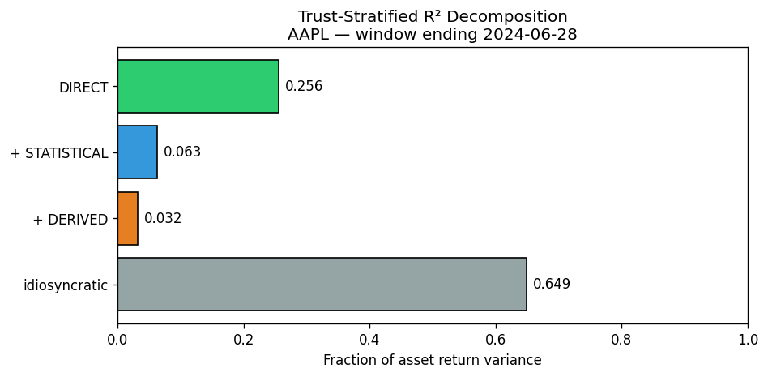
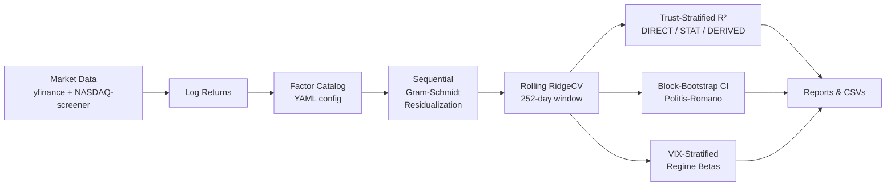

# Honest Factor Research

> **A reproducible model-audit framework for stock factor models.**
> Separates real explanation from inflated explanation — sector mirrors,
> regime shifts, proxy contamination, and overconfident statistics.

[](https://www.python.org/downloads/)
[](LICENSE)
[](#)
[](#reproducibility)
[](https://github.com/EmilHerzberg/honest-factor-research/actions)

> ⚠️ **Not investment advice.** This repository is for research and
> educational purposes only. It does not provide trading recommendations,
> portfolio advice, or financial forecasts. See [Limitations](#limitations).

---

## What this project does

Most stock factor models report impressive R² values — sometimes 0.7, 0.8,
even 0.9.

But that single number hides four problems that determine whether the
model is actually useful:

1. **Sector mirrors** — does the factor ETF you're using *already contain*
   the stock you're explaining? (e.g. ExxonMobil regressed against XLE,
   where ExxonMobil is 22% of XLE)
2. **Proxy contamination** — does your factor proxy measure what its name
   claims? (e.g. XLV "Healthcare" is 10% UnitedHealth, a health insurer —
   not a pharma company)
3. **Regime shifts** — does the same beta apply when markets are calm
   AND when they're in crisis? (Static beta is an average across regimes;
   in any specific regime it can be wrong.)
4. **Overconfident statistics** — Ridge regression implicitly assumes
   Gauß errors, but daily returns have fat tails. The point R² is
   misleadingly smooth.

**A normal model asks:** "How much of this stock can we explain?"
**This project asks:** "How much of that explanation can we honestly defend?"

---

## Why it matters

| Audience | What this gives you |
|---|---|
| **For investors / analysts** | A way to see when a model *looks* good but actually contains very little real explanatory power. |
| **For data scientists / ML engineers** | A testbed for model evaluation, leakage detection, robustness checks, and uncertainty quantification on noisy real-world data. |
| **For AI startup / product teams** | A working example of how to operationalize model trust, uncertainty estimates, and critical evaluation in a domain where overconfidence is easy. |

The methodology generalizes far beyond stocks. Any model that uses
basket-ETF-like aggregate features risks mirror artifacts. Any model
calibrated on quiet-market data is exposed to regime breaks. Any model
that reports a single point estimate hides fat-tail uncertainty.

---

## In plain English

Imagine a model that explains ExxonMobil (XOM) using the energy sector
ETF (XLE). At first glance the fit looks great — R² of ~0.75.

But XOM is *itself* 22% of XLE. So the model is partly explaining XOM
with a basket that already contains XOM. It's not exactly wrong, but it's
much less informative than the high R² suggests. A more honest read:
"this model explains XOM with macro factors at ~18% R², plus an extra
~57% that's mostly XOM-explaining-XOM."

This project builds tools to detect that pattern automatically across
many stocks and factors, and to report what's left when you strip the
mirror out.

---

## Core concepts

Brief plain-language explanations. Full definitions in [`docs/glossary.md`](docs/glossary.md).

- **Factor model** — explains a stock's return as the sum of weighted
  exposures to common drivers (market, interest rates, oil price, value,
  growth, etc.) plus a residual.
- **R²** — the fraction of a stock's return variance that the factors
  jointly explain. Higher = better fit (allegedly).
- **Honest R² (trust-stratified)** — R² split into how much comes from
  trustworthy direct factors vs how much comes from sector baskets
  (which may be self-mirroring).
- **Sector mirror** — when the factor ETF used to "explain" a stock
  already contains that stock as a significant constituent.
- **Regime shift** — the model's beta changes meaningfully between
  high-volatility and low-volatility market periods.
- **Beta flip** — extreme case of regime shift: the beta literally
  reverses sign between regimes.
- **Block-bootstrap confidence interval** — a non-parametric way to
  report "this R² is between 0.55 and 0.70 with 90% confidence" instead
  of a single point that hides fat-tail uncertainty.

---

## Key findings

All numbers below come from actually running the pipeline on a
60-asset MVP universe and a broader universe of 2,241 top-market-cap US
stocks. See [`reports/`](reports/) for the raw outputs.

| Finding | Plain-English meaning | Why it matters |
|---|---|---|
| **32 of 60 assets (53%)** got a tier downgrade under trust-stratified evaluation vs. monolithic R² | More than half of "high-quality" assets weren't as well-explained as the single R² suggested | A single R² is a misleading quality metric for production systems |
| **18.3% of asset-factor pairs** had regime-dependent beta with `\|t_diff\| ≥ 2.5` between high-VIX and low-VIX regimes | Static beta is wrong in at least one regime for 1 in 5 pairs | Models that don't account for regimes will fail exactly when markets get interesting |
| **Lithium beat Gold** as a broadly explanatory factor (mean Δr²=+0.010 vs Gold's +0.005 across 2,241 stocks) | Theory said Gold was essential. Data disagreed. | Empirical validation can overturn intuitive priors — don't trust theory without checking |
| **Brent-spot replaced XLE** for oil exposure → r² for energy stocks roughly doubled (e.g. XOM/COP +0.218 each) | The factor ETF (XLE) was measuring stock reactions to oil, not oil itself | Choosing the right proxy matters more than people realize |
| **Block-bootstrap CIs** showed crisis-period windows have R²-CI widths up to 0.43 | Single-number R² hides huge uncertainty when the data is fat-tailed | If your CI spans 0.3 to 0.7, the point estimate is meaningless |
| **`growth × value` correlation** was fixed from -0.925 to +0.000 after re-ordering residualization | The original tier setup was double-counting style information | Residualization order is a real engineering decision, not a detail |

---

## Visual example

Output from [`examples/01_quickstart.py`](examples/01_quickstart.py)
showing the trust-stratified decomposition for AAPL on a single snapshot:



The standard "R²" for this fit is the green + blue + orange bars summed
(`r²_total`). What's interesting is the split: how much of that R² is
*honest* (direct) vs. how much is statistical-style vs. how much is
sector-derived (possibly mirror).

---

## Architecture



---

## Technical highlights

For reviewers who care about the engineering, not just the findings:

- **Standalone Python package** — pure `pandas` + `scikit-learn` +
  `yfinance` + `pyyaml`. No proprietary databases, no paid feeds, no
  framework lock-in.
- **YAML-driven factor catalog** ([`config/factors.yaml`](honest_factor_research/config/factors.yaml))
  — 28 factors with declared tier, residualization order, trust class
  (DIRECT/STATISTICAL/DERIVED), and optional sector applicability.
- **Sequential Gram-Schmidt residualization** with full diagnostic
  validation (Analysis 1).
- **Stationary block-bootstrap** (Politis-Romano 1994) for time-series
  CI estimation — preserves autocorrelation that plain row-bootstrap
  breaks.
- **VIX-stratified regime betas** — separate Ridge fits on the
  low-VIX / high-VIX subsets of each window, with `min_obs` skip-logic.
- **Sector-conditional factor loading** — factors can declare
  `applicable_sectors: [...]` so each asset gets only relevant factors,
  not a kitchen-sink regression.
- **Multiprocessing-enabled broad-universe replay** (~18 min for 2,241
  stocks × 49 monthly snapshots × 18 variants on 8 cores).
- **Reproducible reports** under [`reports/`](reports/) — markdown +
  CSVs from actual pipeline runs, not hand-edited.
- **Unit tests** for the core math (residualization correctness,
  block-bootstrap properties).
- **Pure data interfaces** — every pipeline function takes/returns
  pandas DataFrames, no hidden DB state.

---

## Quickstart

```bash
git clone https://github.com/EmilHerzberg/honest-factor-research
cd honest-factor-research
pip install -e ".[dev]"

# Run the headline trust-stratified analysis on the bundled sample data
python examples/01_quickstart.py
```

Output (verbatim from a fresh run):

```
Loading factor returns from: data/factor_etfs_2026-05-21.parquet
  -> 28 residualized factors over 1257 trading days

=== Trust-Stratified R² for AAPL on 2024-06-28 ===
r²_direct        = 0.106  (DIRECT factors only)
r²_+statistical  = 0.320  (+ STATISTICAL — marginal +0.214)
r²_total         = 0.358  (+ DERIVED — marginal +0.038)
derived_share    = 10.7%
idiosyncratic    = 64.2%

Plot saved: examples/01_quickstart_decomposition.png
```

Want to explain one specific ticker?

```bash
python examples/03_explain_single_stock.py --ticker XOM
```

Want the full pipeline with all V3.5 features (regime betas, block-bootstrap CIs)?

```bash
python examples/02_full_pipeline.py
```

Want to reproduce *all 10* analyses end-to-end?

```bash
# Note: Analysis 8 (broad universe) needs the full OHLCV dataset.
# Re-fetch via: python -m honest_factor_research.data.fetch (~3-10 min, ~50 MB).
python examples/reproduce_findings.py
```

---

## Example output (real run)

Trust-stratified decomposition from the bundled sample data:

```
Symbol: AAPL    Window-end: 2024-06-28
=====================================
Standard R² (point estimate)         : 0.358
Honest / Direct R²                   : 0.106  (DIRECT factors only)
Statistical-style component          : +0.214 (value + growth + momentum + quality)
Derived / Sector-mirror component    : +0.038 (XL* sector baskets etc.)
Unexplained / idiosyncratic          : 64.2%

Interpretation:
  - The model "looks like" it explains 36% of AAPL's variance.
  - Of that, 11% is from genuinely direct macro factors.
  - Another 21% is from academic style factors (medium trust).
  - Another 4% is from sector baskets — small mirror risk here.
  - The remaining 64% is genuinely idiosyncratic noise.
```

For an asset like XOM (Energy stock), the same analysis typically shows a
much higher *derived* share — because XLE explains XOM via the
self-mirror effect described above.

---

## Project structure

```
honest-factor-research/
├── README.md                          # this file
├── METHODOLOGY.md                     # full methodology deep-dive
├── pyproject.toml                     # installable Python package
├── LICENSE                            # MIT
├── .github/workflows/tests.yml        # CI: lint + tests on every push
│
├── honest_factor_research/            # the Python package
│   ├── data/                          #   data fetching + I/O
│   ├── returns/                       #   factor return loading + residualization
│   ├── exposure/                      #   the rolling-Ridge pipeline
│   ├── analysis/                      #   10 research modules (CLI-runnable)
│   └── config/                        #   factors.yaml catalog
│
├── docs/                              # methodology + plain-English guide
│   ├── 00-plain-english-guide.md      #   for non-quants
│   ├── glossary.md                    #   terms used in the project
│   ├── 01-methodology.md              #   docs index
│   ├── 02-factor-taxonomy.md
│   ├── 03-trust-stratified-r2.md
│   ├── 04-sector-conditional.md
│   ├── 05-regime-switching.md
│   ├── 06-fat-tails-mitigation.md
│   ├── risks-and-improvements.md
│   └── future-investigations.md
│
├── examples/                          # runnable showcases
│   ├── 01_quickstart.py
│   ├── 02_full_pipeline.py
│   ├── 03_explain_single_stock.py     # per-ticker explainer CLI
│   └── reproduce_findings.py
│
├── reports/                           # research outputs as evidence
│   ├── README.md                      #   recommended reading order
│   ├── 2026-05-23-orthogonality-and-discovery/
│   ├── 2026-05-24-v3.4-validation/
│   └── 2026-05-25-v3.5-regime-and-ci/
│
├── data/                              # bundled sample snapshots
│   ├── factor_etfs_2026-05-21.parquet
│   └── broad_universe_constituents_2026-05-24.csv
│
├── tests/                             # unit tests
└── assets/                            # visual specs + diagrams
    └── README.md
```

---

## For recruiters and AI teams

This project demonstrates:

- **Critical model evaluation** — designing diagnostics that show when a
  model is overconfident, not just when it's accurate
- **Reproducible research engineering** — every reported finding is
  reproducible from raw data via committed code; reports are real
  pipeline outputs, not hand-curated
- **Uncertainty quantification** — block-bootstrap CIs, regime
  stratification, trust-tier decomposition
- **Financial / quant ML literacy** — Ridge regression, factor models,
  Gram-Schmidt orthogonalization, autocorrelation-aware time-series
  resampling
- **Data engineering for noisy real-world feeds** — yfinance + NASDAQ
  screener pipelines with graceful failure handling, snapshot freezing
  for reproducibility, sector-conditional configuration
- **Product-oriented technical communication** — same content explained
  at three depths (README → plain-English guide → METHODOLOGY → code)
- **Python package organization** — clean module boundaries, YAML-driven
  configuration, CLI-runnable analysis modules, unit-tested core math
- **Pragmatic trade-off documentation** —
  [`docs/risks-and-improvements.md`](docs/risks-and-improvements.md) is a
  live risk register with explicit mitigations

If this looks like the shape of work you do, [I'd love to talk](mailto:emil.herzberg.eh@gmail.com).

---

## Why I built this

I built this project to explore a broader problem in applied AI and
financial modeling: **models can look precise while hiding leakage,
proxy contamination, regime shifts, and uncertainty.**

Financial factor models are a useful testbed because the data is noisy,
correlations are unstable, the literature has well-known pitfalls
(survivorship bias, look-ahead, regime shifts), and overconfident
explanations are extremely easy to produce.

The goal of this project is **not** to predict the market.
The goal is to **evaluate when a model's explanation can actually be
trusted** — and to build the tooling that makes that evaluation routine
rather than ad-hoc.

The same questions apply to many ML systems outside finance: when does
your validation R² overstate real-world performance? When does your
feature actually cause your prediction vs. when is it a leak? When do
your held-out metrics break under distribution shift? Factor models are
just an unusually data-rich playground for asking these questions.

---

## Reproducibility

Everything here is reproducible with free data sources:

- **yfinance** for OHLCV (used under their TOS for research / non-commercial use)
- **NASDAQ-screener public JSON API** for broad-universe constituents

No paid feeds, no proprietary calibration. To rebuild from scratch:

```bash
pip install -e ".[dev]"
python -m honest_factor_research.data.fetch --factors-only  # ~2 min
python examples/01_quickstart.py
```

For the full broad-universe replay (Analysis 8):

```bash
python -m honest_factor_research.data.fetch                 # ~3-10 min, ~50 MB
python examples/reproduce_findings.py                       # ~1 hour on 8 cores
```

---

## Limitations

This project is honest about what it is and isn't:

- **Historical data only.** Period 2020-2024 covers COVID + the
  post-COVID monetary cycle — not all market regimes.
- **No investment advice.** No backtested strategy. No alpha generation.
  No predictions. See the disclaimer at the top.
- **No live trading.** This is a research / model-audit framework, not a
  production trading system.
- **Survivorship bias.** Broad-universe constituents are NASDAQ-screener's
  *today's* listed stocks. Delisted stocks (Lehman, SVB, etc.) are absent.
  Tracked in [`docs/future-investigations.md#i-002`](docs/future-investigations.md).
- **yfinance data quality.** Free feed; occasional bad ticks for small-cap
  stocks. Documented but not deeply mitigated.
- **Factor catalog is opinionated.** The 28-factor catalog reflects judgment
  calls about what to include. Reasonable people would build a different one.
- **Results are sample-dependent.** Different time windows, different
  universes, and different preprocessing choices will yield different
  numbers. This is a feature of empirical research, not a bug.
- **In-sample R².** All R² numbers are in-sample. Out-of-sample
  generalization is a separate question (see
  [`docs/future-investigations.md#i-007`](docs/future-investigations.md)).
- **No causal claims.** This project measures correlation patterns. It
  does not claim that factor X *causes* asset Y.

---

## Roadmap

Realistic next steps:

- [ ] Single-stock CLI explainer ([`examples/03_explain_single_stock.py`](examples/03_explain_single_stock.py))
      — implemented; could be deepened with sector-context narration
- [ ] Notebook walkthroughs (Jupyter)
- [ ] Out-of-sample R² validation (Analysis 11)
- [ ] Additional regime axes (Rates regime, Bull-Bear regime as production columns)
- [ ] Cross-market tests (European / Asian equities; same methodology, different universes)
- [ ] GitHub Pages project site
- [ ] Interactive dashboard (Streamlit / Dash)
- [ ] Migration from yfinance to Alpha Vantage / Polygon for production stability
- [ ] Sector-specific deep-dive reports (auto-generated)
- [ ] Survivorship-bias-free historical universe (requires CRSP or DIY reconstitution)

Tracked in [`docs/future-investigations.md`](docs/future-investigations.md) with effort estimates.

---

## Citation

If this work informs your own research:

```bibtex
@misc{herzberg2026honest,
  author = {Herzberg, Emil},
  title  = {Honest Factor Research: A Model-Audit Framework for Stock
            Factor Models},
  year   = {2026},
  url    = {https://github.com/EmilHerzberg/honest-factor-research}
}
```

---

## License

MIT — see [LICENSE](LICENSE). Research and educational use only; not
investment advice.
