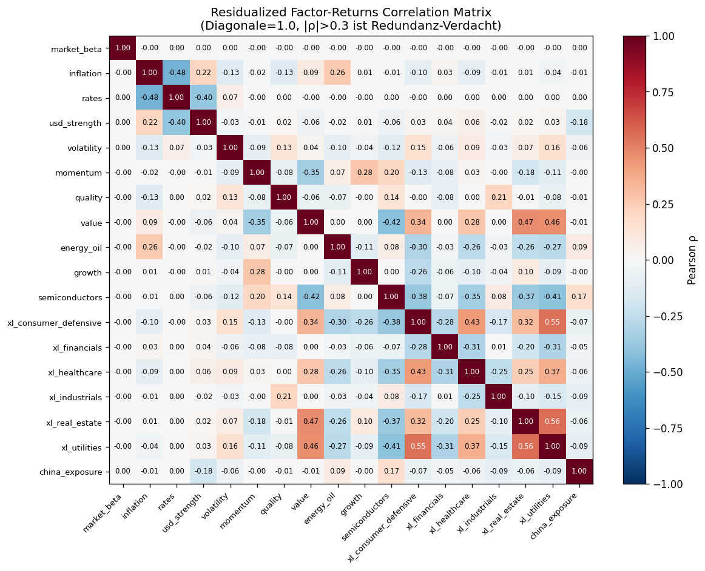

# Analysis 1 — Faktor-Orthogonalität nach Residualisierung

**Datum:** 2026-05-23  
**Faktor-Definitionen-Version:** v1.0  
**Threshold für Redundanz-Flag:** |ρ| ≥ 0.3

## Zusammenfassung

- **18 Faktoren** insgesamt
- **306 Off-Diagonal-Paare** (eindeutig: 153)
- **Mean(|ρ|) Off-Diagonal:** 0.108
- **Max(|ρ|) Off-Diagonal:** 0.558
- **Flagged Pairs (|ρ| ≥ 0.3):** 19

## ⚠️ Redundanz-Kandidaten (|ρ| ≥ 0.30)

| Faktor 1 | Faktor 2 | ρ | Bewertung |
|---|---|---|---|
| `xl_real_estate` | `xl_utilities` | +0.558 | 🟠 Mittlere Redundanz — möglicherweise redundanter Faktor |
| `xl_consumer_defensive` | `xl_utilities` | +0.547 | 🟠 Mittlere Redundanz — möglicherweise redundanter Faktor |
| `inflation` | `rates` | -0.475 | 🟡 Schwache Restkorrelation — akzeptabel, aber beobachten |
| `value` | `xl_real_estate` | +0.470 | 🟡 Schwache Restkorrelation — akzeptabel, aber beobachten |
| `value` | `xl_utilities` | +0.465 | 🟡 Schwache Restkorrelation — akzeptabel, aber beobachten |
| `xl_consumer_defensive` | `xl_healthcare` | +0.428 | 🟡 Schwache Restkorrelation — akzeptabel, aber beobachten |
| `value` | `semiconductors` | -0.415 | 🟡 Schwache Restkorrelation — akzeptabel, aber beobachten |
| `semiconductors` | `xl_utilities` | -0.410 | 🟡 Schwache Restkorrelation — akzeptabel, aber beobachten |
| `rates` | `usd_strength` | -0.397 | 🟡 Schwache Restkorrelation — akzeptabel, aber beobachten |
| `semiconductors` | `xl_consumer_defensive` | -0.376 | 🟡 Schwache Restkorrelation — akzeptabel, aber beobachten |
| `semiconductors` | `xl_real_estate` | -0.370 | 🟡 Schwache Restkorrelation — akzeptabel, aber beobachten |
| `xl_healthcare` | `xl_utilities` | +0.366 | 🟡 Schwache Restkorrelation — akzeptabel, aber beobachten |
| `semiconductors` | `xl_healthcare` | -0.350 | 🟡 Schwache Restkorrelation — akzeptabel, aber beobachten |
| `momentum` | `value` | -0.347 | 🟡 Schwache Restkorrelation — akzeptabel, aber beobachten |
| `value` | `xl_consumer_defensive` | +0.343 | 🟡 Schwache Restkorrelation — akzeptabel, aber beobachten |
| `xl_consumer_defensive` | `xl_real_estate` | +0.319 | 🟡 Schwache Restkorrelation — akzeptabel, aber beobachten |
| `xl_financials` | `xl_healthcare` | -0.309 | 🟡 Schwache Restkorrelation — akzeptabel, aber beobachten |
| `xl_financials` | `xl_utilities` | -0.307 | 🟡 Schwache Restkorrelation — akzeptabel, aber beobachten |
| `energy_oil` | `xl_consumer_defensive` | -0.304 | 🟡 Schwache Restkorrelation — akzeptabel, aber beobachten |

## Faktor-Hierarchie (zur Kontext)

| Tier | Faktor | Residualisiert gegen |
|---|---|---|
| 1 | `market_beta` | — |
| 2 | `inflation` | market_beta |
| 2 | `rates` | market_beta |
| 2 | `usd_strength` | market_beta |
| 2 | `volatility` | market_beta |
| 3 | `momentum` | market_beta, rates |
| 3 | `quality` | market_beta, rates |
| 3 | `value` | market_beta, rates |
| 4 | `energy_oil` | market_beta, rates, value |
| 4 | `growth` | market_beta, rates, value |
| 4 | `semiconductors` | market_beta, rates, growth |
| 4 | `xl_consumer_defensive` | market_beta, rates, quality |
| 4 | `xl_financials` | market_beta, rates, value |
| 4 | `xl_healthcare` | market_beta, rates, quality |
| 4 | `xl_industrials` | market_beta, rates, value |
| 4 | `xl_real_estate` | market_beta, rates |
| 4 | `xl_utilities` | market_beta, rates |
| 5 | `china_exposure` | market_beta, rates, growth |

## Heatmap

## Interpretation

- **Diagonale = 1.0** (Korrelation eines Faktors mit sich selbst)
- **Off-Diagonale sollten ≈ 0** sein wenn die Residualisierung
  perfekt funktioniert.
- **|ρ| > 0.3:** Faktor ist nicht vollständig residualisiert, oder
  zwei Faktoren teilen substanzielle gemeinsame Information
- **|ρ| > 0.7:** ein Faktor ist quasi-redundant — sollte entweder
  gestrichen oder die Residualisierungs-Reihenfolge geändert werden.

## Detailed Correlation Matrix (CSV)

Vollständige Matrix in `01_factor_orthogonality_corr.csv`.
