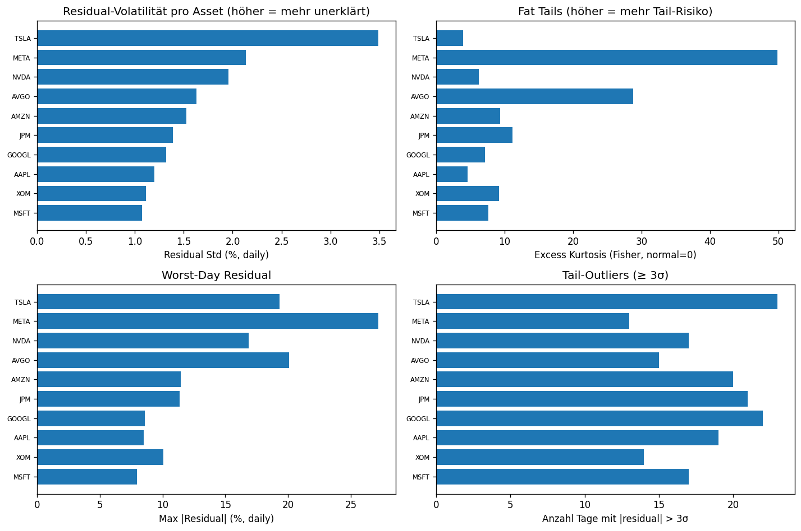

# Analysis 3 — Pro-Asset Residual-Analyse

**Datum:** 2026-05-23

## Zusammenfassung

- **10 Assets** analysiert (übersprungen: 0)
- **Mean Residual-Std:** 1.68% daily
- **Max Residual-Std:** 3.49% daily (TSLA)
- **Mean Excess Kurtosis:** 13.78 (Gauß=0, > 0 = fat tails)

## Top-10: Höchste Residual-Std (am schlechtesten erklärt)

| Symbol | Sector | Std (% daily) | Kurtosis | Outliers ≥3σ | Worst Day |
|---|---|---|---|---|---|
| `TSLA` | Consumer Cyclical | 3.49% | +3.93 | 23 | 2020-09-08 |
| `META` | Communication Services | 2.14% | +49.90 | 13 | 2022-02-03 |
| `NVDA` | Technology | 1.95% | +6.20 | 17 | 2023-05-25 |
| `AVGO` | Technology | 1.63% | +28.79 | 15 | 2024-12-13 |
| `AMZN` | Consumer Cyclical | 1.53% | +9.37 | 20 | 2022-02-04 |
| `JPM` | Financial Services | 1.39% | +11.15 | 21 | 2020-03-13 |
| `GOOGL` | Communication Services | 1.32% | +7.15 | 22 | 2023-10-25 |
| `AAPL` | Technology | 1.20% | +4.55 | 19 | 2020-07-31 |
| `XOM` | Energy | 1.11% | +9.15 | 14 | 2020-03-17 |
| `MSFT` | Technology | 1.07% | +7.57 | 17 | 2020-03-16 |

## Bottom-10: Niedrigste Residual-Std (am besten erklärt)

| Symbol | Sector | Std (% daily) | Kurtosis |
|---|---|---|---|
| `MSFT` | Technology | 1.07% | +7.57 |
| `XOM` | Energy | 1.11% | +9.15 |
| `AAPL` | Technology | 1.20% | +4.55 |
| `GOOGL` | Communication Services | 1.32% | +7.15 |
| `JPM` | Financial Services | 1.39% | +11.15 |
| `AMZN` | Consumer Cyclical | 1.53% | +9.37 |
| `AVGO` | Technology | 1.63% | +28.79 |
| `NVDA` | Technology | 1.95% | +6.20 |
| `META` | Communication Services | 2.14% | +49.90 |
| `TSLA` | Consumer Cyclical | 3.49% | +3.93 |

## Worst-Day Events (potenzielle Outlier-Anomalien)

Tage an denen der größte Residual auftrat — könnten Event-Tage sein die unser Faktor-Modell nicht erklärt.

| Datum | Anzahl Assets mit Worst-Day |
|---|---|
| 2020-03-13 | 1 |
| 2020-03-16 | 1 |
| 2020-03-17 | 1 |
| 2020-07-31 | 1 |
| 2020-09-08 | 1 |
| 2022-02-03 | 1 |
| 2022-02-04 | 1 |
| 2023-05-25 | 1 |
| 2023-10-25 | 1 |
| 2024-12-13 | 1 |

(Cluster bei einem Datum → marktweites Event-Day unmodelliert)

## Plots

## Interpretation

- **Hohe Residual-Std** (z. B. > 1.5% daily): Faktor-Modell erklärt diese 
  Aktie schlecht — entweder fehlt ein wichtiger Faktor oder die Aktie ist 
  stark idiosynkratisch.
- **Hohe Kurtosis (> 3)**: fat tails — Aktie hat häufiger extreme Tage als 
  normal-verteilt. Klassisch für meme-Stocks, Biotech (Trial-Outcomes), 
  Small-Caps.
- **Cluster im worst_date**: wenn mehrere Assets ihren Worst-Day am 
  gleichen Datum hatten → Markt-weites Event unmodelliert (z. B. COVID-Crash 2020-03-12).

**Action-Items zu Risiko 2 (R²-Stabilität):**
- Assets mit höchster Residual-Std sind Kandidaten für asset-spezifische Faktoren
- Fat-Tail Assets brauchen evtl. robust-statistics statt OLS

Detaildaten in `03_residual_analysis.csv`.
